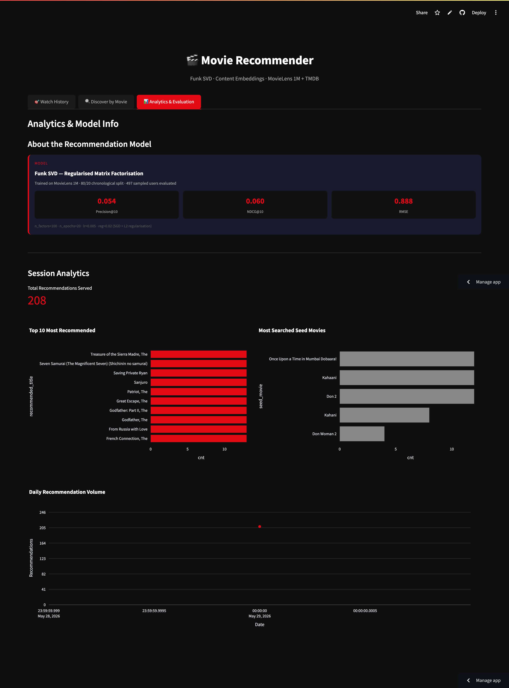

# 🎬 Movie Recommender

A movie recommendation web app combining **collaborative filtering** (Funk SVD) and
**content-based** recommendations (sentence-transformer embeddings), built on the
**MovieLens 1M** dataset and enriched live with poster art and metadata from the **TMDB API**.

### ▶️ [**Try the live demo**](https://movie-recommendation-manualfilms-watch-history.streamlit.app/)


---

## What it does

| Tab | What it does |
|-----|--------------|
| **🎯 Watch History** | Pick a movie fan (a real MovieLens user with a distinct taste — Action Buff, Horror Fan, Classic Cinephile…) and get personalised recommendations from Funk SVD. |
| **🔍 Discover by Movie** | Type any movie; get similar films via semantic embeddings, grouped into shelves, with mood and language (Hollywood / Indian) filters. |
| **📊 Analytics** | Model details, evaluation metrics, and live usage analytics. |

| Watch History | Discover | Analytics |
|:---:|:---:|:---:|
|  |  |  |

## How it works

**Collaborative filtering — Funk SVD.** Regularised matrix factorisation (Simon Funk's
Netflix-Prize algorithm), trained with SGD + L2 regularisation. The learned user/item factors
and biases are exported to plain numpy arrays for fast, dependency-light inference.

**Genre-aware hybrid.** Raw SVD top-N skews toward universally acclaimed films for everyone
(item-bias dominance), so recommendations didn't visibly match a user's taste. The fix:
**restrict candidates to the user's signature genre, then rank within them by predicted rating** —
a content-filter + collaborative-ranking hybrid that keeps the personalisation while guaranteeing
relevance.

**Content-based — semantic embeddings.** The Discover tab encodes `title + overview + genres`
with `sentence-transformers` (`all-MiniLM-L6-v2`) and ranks candidates by cosine similarity to the
seed film. (TF-IDF was tried first but gave vague results, especially for non-English films.)

**TMDB enrichment.** Posters, ratings, and metadata are fetched from TMDB with a persistent HTTP
session, on-disk JSON caching, and fuzzy title matching with an exact-match override.

## Evaluation

MovieLens 1M, 80/20 **chronological** split, 497 sampled users, relevant = rating ≥ 4.0:

| Model | Precision@10 | NDCG@10 | RMSE |
|-------|:---:|:---:|:---:|
| Popularity baseline | 0.088 | 0.097 | — |
| Item-based CF (K=20) | 0.028 | 0.030 | — |
| **Funk SVD** (100 factors) | 0.054 | 0.060 | **0.888** |

> On a chronological split the popularity baseline is deliberately hard to beat — test items
> correlate with temporal popularity, while CF/MF recommend historical taste matches. Funk SVD's
> real strengths are rating-prediction accuracy (RMSE) and genuine per-user personalisation.

## Tech stack

`Python 3.11` · `Streamlit` · `scikit-surprise` (Funk SVD) · `sentence-transformers` ·
`scikit-learn` · `pandas` / `numpy` / `scipy` · `SQLite` · `TMDB API`

## Project structure

```
app.py                  # Streamlit entrypoint, loads models, renders tabs
config.py               # constants, genre maps, personas
data/
  loader.py             # read MovieLens .dat files
  preprocessor.py       # parse / filter / chronological split / sparse matrix
  tmdb_client.py        # TMDB API + JSON cache + persistent session
engines/
  collaborative.py      # Funk SVD (+ Item-CF / Popularity baselines)
  content_based.py      # sentence-transformer embedding recommender
  evaluator.py          # Precision@K / Recall@K / NDCG@K / RMSE
ui/                     # the three tabs + shared card components
storage/db.py           # SQLite logging for analytics
scripts/
  precompute.py         # build models (run once)
  evaluate.py           # compute evaluation metrics
```

## Run locally

```bash
python3.11 -m venv venv
venv/bin/pip install -r requirements.txt

# add your TMDB API key (free from themoviedb.org)
echo 'TMDB_API_KEY=your_key_here' > .env

# build the models once (downloads MovieLens 1M, trains Funk SVD ~3-5 min)
venv/bin/python scripts/precompute.py

venv/bin/streamlit run app.py
```

## Data & credits

- [MovieLens 1M](https://grouplens.org/datasets/movielens/1m/) — GroupLens Research
- Movie metadata and posters from [TMDB](https://www.themoviedb.org/) (this product uses the TMDB
  API but is not endorsed or certified by TMDB)
